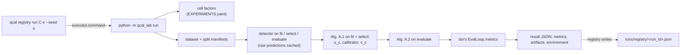

# qcal_lab: Phase 1 science code

`src/qcal_lab/` is the agent-owned science package for the clean-room FP32 reproduction of
Kuzucu et al., *On Calibration of Object Detectors: Pitfalls, Evaluation and Baselines*
(ECCV 2024, arXiv:2405.20459). The change proposal is
[changes/reproduce-kuzucu-eccv24-baselines.md](changes/reproduce-kuzucu-eccv24-baselines.md).

It contains no results and computes no reported metric. The reported metrics (AP, LRP,
D-ECE, LaECE0, LaACE0) come from Ian's hand-written evaluation loop, which plugs in through
one interface (below).

## How a run flows



1. **Plan.** The program reads the cell's factors from `EXPERIMENTS.yaml`. It refuses any
   factor or value it does not understand, so a cell cannot ask for something that would be
   silently ignored. Phase 1 accepts `precision` in {`fp32`, `fp32_tf32_off`}, `target =
   torch_fp32`, `shift = id`, and the calibrators `none`, `platt` and `isotonic` with scope
   `per_class` or `global`.
2. **Splits.** Each role maps to a manifest in `data/manifests/` (`[splits]` in the lab
   configuration):

   | Role | Default split |
   |---|---|
   | `fit` | `calibrator_fit_split` |
   | `select` | `val` |
   | `evaluate` | `test` |

   The three roles must be three different splits (CLAUDE.md rule 3). Before any detector
   work, the program refuses unless `qcal leakage` passes on every manifest and the three
   splits share no image id. The seed draws the `calibrator_fit_split_size` subset of the
   fit split; `fit_draw.seeded` in the record says whether the seed did anything.
3. **Detections.** The detector runs once per split. Real detectors see image metadata only,
   never ground-truth boxes. Raw predictions are written as deterministic JSON Lines and
   cached under a content address. The address covers:
   - the detector settings, and the contents of the files they name;
   - library versions;
   - the annotation file, the split ids, and the image directory and bytes;
   - the `qcal_lab` source.

   A cache hit is used only if its header and image ids match exactly. The record names the
   run that produced each cached file.
4. **Calibration.** The program follows arXiv:2405.20459 Alg. A.1. The paper's single
   validation set is split in two by the pre-registration, so calibrators fit on the fit
   split and thresholds are selected on val only:
   1. select the calibration threshold u_c per class on the `select` split (val);
   2. fit the calibrator on fit-split detections scoring at least u_c (identity for an
      empty class, App. C.3);
   3. select the operating threshold v_c per class on the calibrated `select` split.
5. **Evaluation.** Alg. A.2 is applied to the evaluate split, then `EvalLoop.metrics` runs on
   it. Nothing else ever sees the evaluate split.
6. **Result.** The program writes the executor contract's JSON:
   - the metrics;
   - the artifacts: raw and calibrated predictions and `calibration.json`, each hashed by
     the registry;
   - the environment:
     - the dataset, split and draw digests;
     - the repository-layer and effective lab configuration digests, and the source digest;
     - the detector fingerprint and its runtime switches (for example TF32);
     - the evaluation loop's module, file and sha256;
     - the thresholds and their splits;
     - the retained detections per class on the evaluate split;
     - the prediction-cache provenance;
     - the interpreter that ran the program.

## Ian's evaluation loop

`eval_loop.module` (default `qcal_lab.handwritten.eval_loop`) must provide
`build(options)`. It returns an object with three methods
(`qcal_lab.evaluation.EvalLoop`):

| Method | Called on | Returns |
|---|---|---|
| `targets(predictions, ground_truth)` | the fit split, after the u_c threshold | per image, one target in [0, 1] per detection (the IoU with the matched object; 0 for a false positive) |
| `threshold_objective(predictions, ground_truth, label=, stage=)` | the select split: raw (`stage="calibration"`, LRP with tau = 0 in the paper), then calibrated (`stage="operating"`, LRP with tau) | a number, lower is better; NaN when undefined |
| `metrics(predictions, ground_truth)` | the evaluate role, once | `{name: value}`, with names usable in claim references |

The interface is a proposal; Ian may change it, and the pipeline follows.

- Until the module exists, every run fails before any detector work with a message saying
  so. Agents never create files under `*/handwritten/*`.
- **Only Ian's files can report metrics.** The program imports the configured module, then
  refuses it unless its source file is in the `ian_only` policy category. The single
  exception is the fixture stand-in (`qcal_lab.fixture_eval`), which refuses every dataset
  except an unmodified generated fixture. The record stores the module, file and sha256.
- **Two choices are left to Ian's loop.** Targets are computed on the fit detections that
  survive u_c, which matches the paper under greedy-by-score matching [unverified]. The tau
  used at each stage is his to define and document.

## Ian's data

The split manifests (`data/manifests/`), the oracle outputs (`tests/parity/fixtures/`) and
the published reference values (`docs/reference/`) are in the `ian_data` policy category.
Agents read them; the session guard refuses edit tools on them, and CI requires Ian's
signature for any change. `python -m qcal_lab splits` never replaces an existing split: to
change one, Ian deletes it and records why in `AMENDMENTS.md`. The prediction cache
(`runs/cache/`) is `registry_only`.

## Configuration

The packaged defaults are in `src/qcal_lab/resources/defaults.toml`, and every key is
documented there. The repository layer is `configs/lab.toml`, which the registry hashes into
each run's `config_hash`. Science settings never come from environment variables. Empty
strings mean "not decided": the code refuses to run rather than guess.

## Commands

```bash
make smoke        # the whole loop on a synthetic 20-image fixture, through the real registry
make lab-status   # what still blocks a registered run (Ian's inputs, configuration, oracle)
make parity       # parity with fiveai/detection_calibration outputs (tests/parity/README.md)
python -m qcal_lab splits import --annotations FILE --split val      # a published split
python -m qcal_lab splits partition --annotations FILE --seed S --sizes val=N1,test=N2
python -m qcal_lab splits verify --annotations FILE                  # manifests vs dataset
```

The smoke test uses a synthetic dataset with no pixels. A dataset counts as the fixture
only if its file is byte-identical to the document its recorded parameters regenerate;
copying the description into real annotations does not pass. The fixture detector and the
fixture evaluation loop refuse every other dataset, and the loop's metric names start with
`smoke_`, so the smoke test cannot produce a reportable number. The smoke test also re-runs
one cell with the cache off and checks that predictions, calibration and metrics are
byte-identical.

## Extending

| To add | Do this |
|---|---|
| A calibrator | implement `fit`, `transform` and `to_dict`, then `CALIBRATORS.register(name, CalibratorKind(build, load))`, citing the paper equation |
| A detector kind | register a factory in `qcal_lab.models.DETECTORS`, then configure `[detectors.<name>] kind = ...` |
| A dataset or shift | add `[datasets.<shift>]` and extend `factors.supported` (Phase 2: COCO-C, Foggy) |
| An oracle parity case | add a JSON file to `tests/parity/fixtures/` (schema in `tests/parity/README.md`) |

## Verification status

| Component | Status |
|---|---|
| Platt scaling, isotonic regression, Alg. A.1/A.2 | unit and property tests; oracle parity pending outputs |
| Isotonic duplicate-score merging | follows scikit-learn's convention as remembered [unverified]; parity decides |
| Threshold grid and `probability_epsilon` | the paper does not state them; confirm against the oracle |
| Alg. A.1 threshold selection | unit tests only; no oracle case kind covers it yet (NEXT_STEPS) |
| MMDetection adapter | tested against fakes; unverified until the environment spike |
| Splits | digests equal `qcal leakage`'s; deterministic and order-independent |
