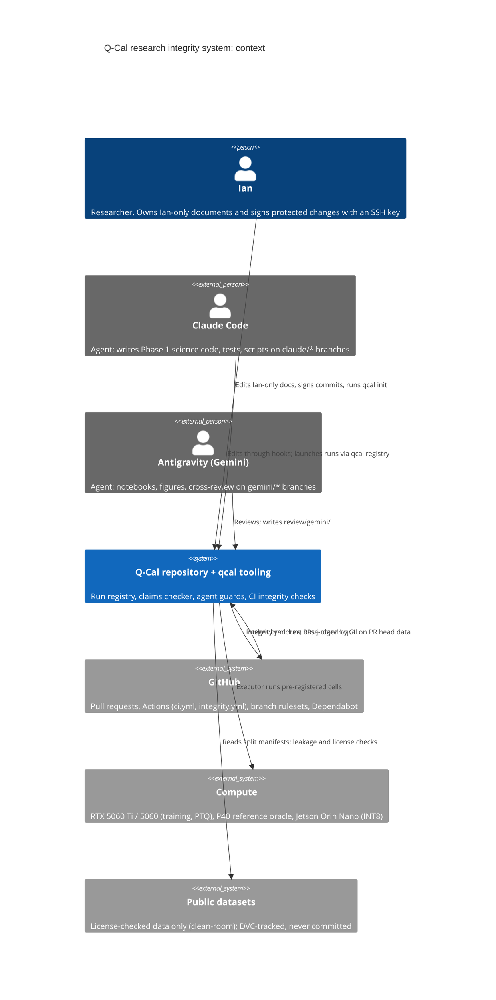
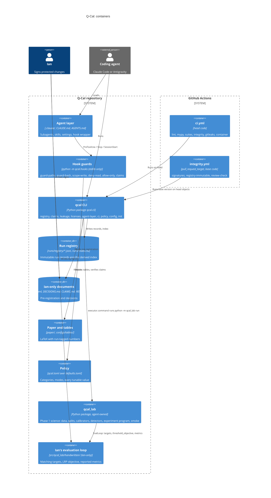
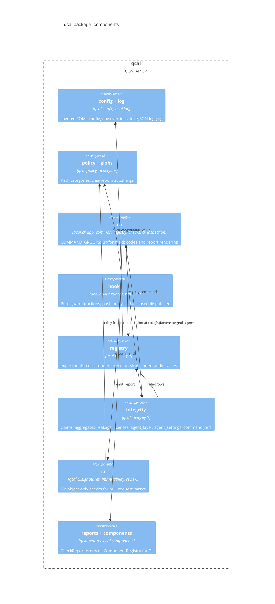
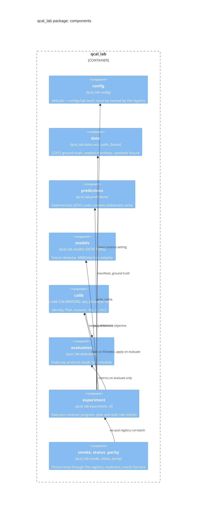
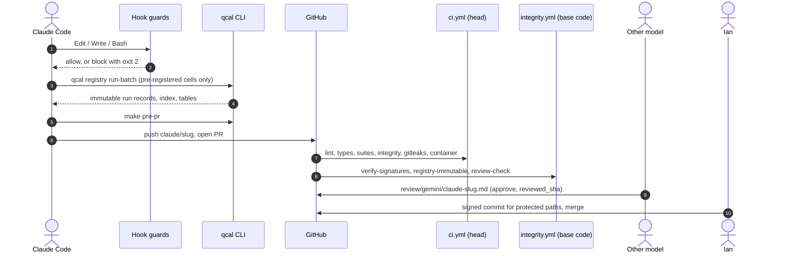

# Architecture (C4)

The C4 model describes Q-Cal at four levels:

1. context: who and what the system serves;
2. containers: the deployable and storable parts;
3. components: inside the `qcal` package;
4. a dynamic view: how a pull request moves through the controls.

All diagrams are Mermaid, render on GitHub, and were checked with a Mermaid validator.

The design rule behind every box: **hooks are feedback, signed commits plus CI are the
control** (see `CLAUDE.md` and [`docs/AGENT_LAYER.md`](../AGENT_LAYER.md)).

## Level 1: system context

## Level 2: containers

| Container | Trust | Notes |
|---|---|---|
| Hook guards | feedback | Fail closed: the wrapper turns any crash into exit 2. Stdlib-only, so they run before the venv exists. |
| qcal CLI | tool | Exit codes: 0 pass, 1 a check or run failed, 2 usage or configuration error. |
| Run registry | append-only | One immutable JSON per run; `runs/index.csv` is derived and checked for staleness. |
| qcal_lab | agent-owned | Runs only behind the executor contract; the registry, not `qcal_lab`, writes the record. See [LAB.md](../LAB.md). |
| ci.yml | head code | Untrusted by design; it can only prove the head is self-consistent. |
| integrity.yml | base code | `pull_request_target`; the head is fetched as git data and never executed. |

## Level 3: components of the `qcal` package

Extension points, all without editing the dispatchers:

| To add | Do this |
|---|---|
| A CLI command group | write `add_commands(sub)` in a new `qcal/cli/<group>.py` and append it to `COMMAND_GROUPS` |
| An executor | `@EXECUTORS.register("name")`; select with `--executor name` or `executor.kind` |
| An environment collector | `@COLLECTORS.register("name")`; list it in `registry.env_collectors` |
| An aggregate | register it in `qcal.integrity.aggregates`; table specs and claims refs pick it up |
| A check report | implement `passed`, `to_dict()` and `render_text()` (`qcal.reports.CheckReport`) and return `emit_report(...)` |
| A policy category | add `[policy.categories] name = [...]` in `qcal.toml` (signed) |

## Level 3: components of the `qcal_lab` package

## Dynamic view: a pull request

## Decisions recorded here

- **Deterministic scripts over agents.** Launching runs, auditing coverage, building tables,
  checking licenses and validating the agent layer are `qcal` commands with tests, not prompts.
- **Policy from the base ref.** Every CI check that judges a pull request reads `qcal.toml`
  and `allowed_signers` from the base commit, so a pull request cannot relax its own rules.
- **Net content from the fork point.** The signature check diffs `merge-base(base, head)..head`, so a
  branch that is merely behind base passes. A merge that drops or rolls back protected
  content still fails.
- **Science code behind the executor contract.** `qcal_lab` never writes the registry. A
  result exists only as a record that `qcal registry run` wrote from the program's result
  file. The fixture stand-ins refuse real datasets, so the smoke test cannot fabricate a
  number.
- **One configuration system.** The plan's Hydra configs became TOML layered the same way as
  `qcal.toml`. The registry refuses free-form overrides, which are Hydra's main feature.
- **Report-only bootstrap.** `signing.mode` and `review.mode` start as `bootstrap`; Ian
  switches each to `enforce` in a signed commit once keys and reviewers are in place.
